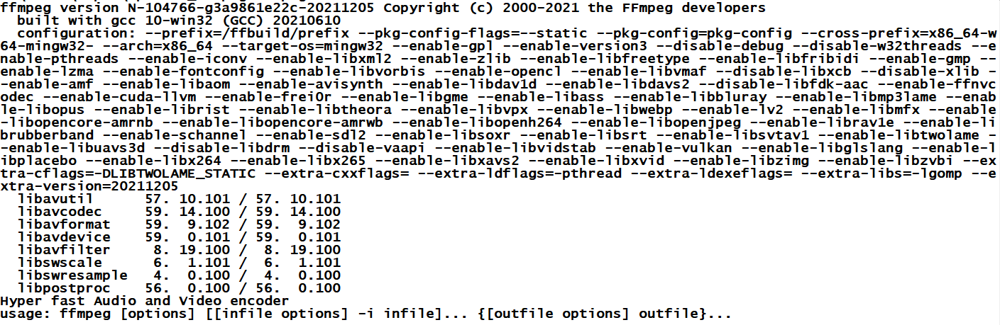

Tutorial de uso de ``ffmpeg``
==============================

En el día a día es frecuente trabajar con archivos de audio y vídeo de distintos formatos. Aunque herramientas online como [YouTube](https://youtube.com) o [Vimeo](https://vimeo.com) simplifican el trabajo y la compartición de estos archivos a menudo es útil hacer un procesamiento simple de estos archivos en nuestros propios equipos. Esto tiene alguna ventajas:

* En líneas generales es más rápido hacer el procesamiento en local.
* Disponemos de muchas más opciones.
* Tenemos el máximo control sobre la privacidad del archivo.

Conceptos básicos
----------------------

Hoy en día, cuando descargamos un vídeo lo normal es que dentro de él pueda haber varios **flujos**. Estos flujos pueden ser de muchos tipos.

* Vídeo.
* Audio
* Subtítulos
* Información sobre capítulos.
* Etc...

Así, al visualizar un archivo nuestro software de reproducción analizará el archivo e irá extrayendo y sincronizando los sucesivos flujos para que podamos ver las imágenes, a la vez que escuchamos el sonido, nos muestra el subtítulo correcto, etc...

Así, si examináramos un archivo ``.mkv`` o ``.avi`` veríamos que en realidad lo que llamamos un archivo con "una película" en realidad integra muchas cosas distintas. Por eso lo correcto es llamar a estos archivos "contenedores". En los párrafos siguientes veremos como manipular estos ficheros usando ``ffmpeg``

Instalación
=================

Para todo el tutorial vamos a necesitar dos cosas: ``ffmpeg`` y algún archivo de vídeo.

1. El ejecutable de ``ffmpeg`` puede encontrarse en su página web [http://www.ffmpeg.org](http://www.ffmpeg.org/). Si tenemos GNU/Linux simplemente necesitaremos ejecutar ``sudo apt-get install ffmpeg``.
2. Algún archivo de vídeo. Si no tenemos ninguno a mano hay películas de libre distribución como Sintel, que podremos descargar en [https://durian.blender.org/download/](https://durian.blender.org/download/). Esta película en concreto puede descargarse a resolución FullHD. Debido a que Sintel es más cortometraje que película el archivo entero en alta resolución ocupa poco más de 1 GB.
3. Algún archivo de audio. En el mismo sitio web de Sintel podemos descargar la banda sonora de la película con el nombre ``sintel-m+e.flac``.
4. Un archivo de subtítulos. Sintel también incluye diversos archivos de subtítulos de los cuales descargaremos por ejemplo la versión en español. Dicho archivo se llama ``sintel_es.srt``. En realidad la película descargada *ya incluye los subtítulos* pero nos vendran bien el tenerlos por separado para practicar algunas operaciones.

Una vez descargados ambos archivos, el ejecutable y el vídeo, pondremos ambos ficheros en el mismo directorio, abriremos el símbolo del sistema (o una consola en el caso de GNU/Linux) y teclearemos::

    ffmpeg

Deberíamos ver algo como esto:

Si no vemos algo similar a lo anterior deberemos investigar cual es el problema, que probablemente sea alguno de estos:

* No hemos descomprimido el fichero descargado.
* No estamos en el directorio correcto.
* No hemos escrito bien el comando.

Uso básico de ``ffmpeg``
===========================

Aunque ``ffmpeg`` es muy potente, la mayor parte del tiempo solo necesitaremos unas cuantas operaciones básicas, que indicamos a continuación

Obtención de información
---------------------------

El archivo de vídeo que hemos descargado se llama ``Sintel.2010.1080p.mkv``. Para obtener información sobre él basta con ejecutar::

    ffmpeg Sintel.2010.1080p.mkv

Deberíamos ver algo como esto::

    Input #0, matroska,webm, from 'Sintel.2010.1080p.mkv':
    Metadata:
        encoder         : libebml v1.0.0 + libmatroska v1.0.0
        creation_time   : 2011-04-25T12:57:46.000000Z
    Duration: 00:14:48.03, start: 0.000000, bitrate: 10562 kb/s
    Chapters:
        Chapter #0:0: start 0.000000, end 103.125000
        Metadata:
            title           : Chapter 01
        Chapter #0:1: start 103.125000, end 148.667000
        Metadata:
            title           : Chapter 02
        Chapter #0:2: start 148.667000, end 349.792000
        Metadata:
            title           : Chapter 03
        Chapter #0:3: start 349.792000, end 437.208000
        Metadata:
            title           : Chapter 04
        Chapter #0:4: start 437.208000, end 472.075000
        Metadata:
            title           : Chapter 05
        Chapter #0:5: start 472.075000, end 678.833000
        Metadata:
            title           : Chapter 06
        Chapter #0:6: start 678.833000, end 744.083000
        Metadata:
            title           : Chapter 07
        Chapter #0:7: start 744.083000, end 888.032000
        Metadata:
            title           : Chapter 08
    Stream #0:0(eng): Video: h264 (High), yuv420p(tv, bt709/unknown/unknown, progressive), 1920x818, SAR 1:1 DAR 960:409, 24 fps, 24 tbr, 1k tbn
    Stream #0:1(eng): Audio: ac3, 48000 Hz, 5.1(side), fltp, 640 kb/s
        Metadata:
        title           : AC3 5.1 @ 640 Kbps
    Stream #0:2(ger): Subtitle: subrip
    Stream #0:3(eng): Subtitle: subrip
    Stream #0:4(spa): Subtitle: subrip
    Stream #0:5(fre): Subtitle: subrip
    Stream #0:6(ita): Subtitle: subrip
    Stream #0:7(dut): Subtitle: subrip
    Stream #0:8(pol): Subtitle: subrip
    Stream #0:9(por): Subtitle: subrip
    Stream #0:10(rus): Subtitle: subrip
    Stream #0:11(vie): Subtitle: subrip

¿Como se interpreta esto? Bien, ``ffmpeg`` ha recibido un fichero de entrada, al que ha denominado ``Input #0`` (cabe destacar que ``ffmpeg`` puede aceptar varios ficheros de entrada para por ejemplo tomar el vídeo del fichero 0 y el audio del fichero 1). Dentro de ``Input #0`` encontramos lo siguiente:

* Metadatos.
* Duración del fichero.
* Información sobre capítulos: para cada uno de ellos podemos ver su número y donde empiezan y acaban. Observar que aparecen indicados como ``Chapter #0:4`` lo que significa *capítulo 4 del fichero de entrada 0*
* Hay un flujo con el número 0, que es de vídeo, codificado con el códec h264.
* Hay un flujo con el número 1, que es de audio, codificado con el códec ac3.
* Hay varios flujos de subtítulos, con números entre el 2 y el 11, en los que se ha indicado el idioma de escritura.

Conversiones básicas
----------------------

Si solo queremos convertir un fichero que usa un formato de contenedor en otro distinto, el proceso es simple. Por ejemplo, para convertir nuestro fichero a otro que utilice AVI como contenedor solo tendremos que escribir esto::

    ffmpeg -i Sintel.2010.1080p.mkv Sintel.avi

Este comando toma un fichero de entrada (opción ``-i``) y genera un fichero de salida (con el nombre que escribamos al final). Una vez lanzado el comando, ``ffmpeg`` mostrará información sobre los ficheros de entrada y despues  empezará a realizar la conversión. En general **convertir vídeo es un proceso muy lento que se ve muy influido por la potencia del microprocesador del que se disponga**. Pasado un tiempo tendremos ambos ficheros y podremos abrirlos con cualquier reproductor multimedia. 

Despues de obtener nuestro archivo AVI podemos examinarlo con este comando::

    ffmpeg -i Sintel.avi

Y podremos ver algo como esto::

    Input #0, avi, from 'Sintel.avi':
    Metadata:
        software        : Lavf59.9.102
    Duration: 00:14:48.07, start: 0.000000, bitrate: 1732 kb/s
    Stream #0:0: Video: mpeg4 (Simple Profile) (FMP4 / 0x34504D46), yuv420p, 1920x818 [SAR 1:1 DAR 960:409], 1592 kb/s, 24 fps, 24 tbr, 24 tbn
    Stream #0:1: Audio: mp3 (U[0][0][0] / 0x0055), 48000 Hz, stereo, fltp, 128 kb/s
        Metadata:
        title           : AC3 5.1 @ 640 Kbps

Como vemos, ha habido algunos cambios:

* El flujo original de vídeo estaba codificado con el códec h264. En el fichero final está codificado con mpg4.
* El audio original estaba codificado con ac3. El final lo está en mp3.

¿A qué se debe esto? Muy sencillo, ``ffmpeg`` tiene sus propios códecs por defecto, así que si no indicamos nada, **convertirá los flujos originales a los formatos por defecto, lo que puede ser bastante lento**

Códecs
--------------

Un códec es un **CO**dificador-**DEC**odificador (en realidad en español se dice "descodificador") de audio o de vídeo. Codificar algo consiste en tomar los datos originales y transformarlos en otra secuencia de datos distinta y descodificar implica tomar la secuencia de datos transformada y recuperar los datos originales. Como en muchos casos interesa reducir el tamaño de los datos muchos códec tienen la capacidad de comprimir. Además, en algunos casos, la compresión puede ser mejor si aceptamos cierta pérdida de calidad se puede decir que hay "compresión con pérdida" y "compresión sin pérdida".

Ocurre también que hay literalmente cientos de mecanismos para hacer esta tarea y en ocasiones podremos observar que algunos ficheros han sido codificados con un códec que nuestro programa, nuestro móvil o nuestra TV no tiene lo que daría lugar a que **no se pueda ver u oír (o ambos) el fichero**. En estos casos nos interesará **"transcodificar"** uno o varios flujos del fichero.

Volvamos a ver qué códecs había usado ``ffmpeg`` en nuestro fichero::

    Input #0, avi, from 'Sintel.avi':
    Metadata:
        software        : Lavf59.9.102
    Duration: 00:14:48.07, start: 0.000000, bitrate: 1732 kb/s
    Stream #0:0: Video: mpeg4 (Simple Profile) (FMP4 / 0x34504D46), yuv420p, 1920x818 [SAR 1:1 DAR 960:409], 1592 kb/s, 24 fps, 24 tbr, 24 tbn
    Stream #0:1: Audio: mp3 (U[0][0][0] / 0x0055), 48000 Hz, stereo, fltp, 128 kb/s
        Metadata:
        title           : AC3 5.1 @ 640 Kbps

Como vemos, ``ffmpeg`` ha recodificado el vídeo y lo ha pasado de "h264" a "mpeg4" y ha recodificado el audio de "ac3" a "mp3". Si deseamos usar un codec de audio o de vídeo concreto podemos pedirle a ``ffmpeg`` que lo utilice usando las opciones ``-acodec <codec_de_audio>`` o ``-vcodec <codec_de_video>``

Podemos ver la lista de codecs de ``ffmpeg`` usando esto::

    ffmpeg -codecs

Lo que nos mostrará una lista (muy muy larga) de todos los codec que el programa maneja. Al comienzo de la lista veremos algo como esto, que nos explica lo que significa la información que vemos (incluimos una traducción del significado)::

    V..... = Video (el códec se usa para codificar/descodificar vídeo)
    A..... = Audio (el códec se usa para codificar/descodificar audio)
    S..... = Subtitle (el códec se usa para codificar/descodificar subtítulos)
    .F.... = Frame-level multithreading (los fotogramas se pueden procesar en paralelo)
    ..S... = Slice-level multithreading (se pueden procesar en paralelo trozos de un fotograma)
    ...X.. = Codec is experimental (no requiere traducción)
    ....B. = Supports draw_horiz_band (el codec acepta técnicas que mejoran la eficiencia de caché)
    .....D = Supports direct rendering method 1 (el codec acepta la aceleración hardware)
